# comp_archi_SoC
Computer Architechture SoC
### Day1
What is a system simulator?

* System simulators are tools which are used by computer architects to simulate their designs.
* There are simulators for CPUs, RAM, SSDs, SoCs, NoCs, etc. which allow architects to validate their designs before going to the fabrication process.
* We are going to use one such CPU simulator today called Gem5.

Why do we need system simulators?

* Fabrication is an expensive step so computer architects need to be sure that their designs are valid before they are sent to the fabrication facilities.
* Simulators provide a safe environment to experiment with different system parameters.
* Simulators allow architectects to get an estimate of system performance without the need to build physical machines.

What is gem5?

* The gem5 simulator is a modular platform for computer-system architecture research, encompassing system-level architecture as well as processor microarchitecture.
* Is is the result of the merger of two simulators: M5 and GEMS.

What all is supported by Gem5?

* Different ISAs: x86, ARM, ALPHA, POWER, SPARC, MIPS
* Different CPU Models: TimingSimple, AtomicSimple, InOrder, OutOfOrder
* Different binaries for performance and debug modes
* Full System and System Emulation simulation models
* Custom memory models using Ruby

Today’s goals

* Installing gem5 on a Linux distribution
* Building gem5
* Creating a simple configuration to simulate
* Examining simulation outputs
* Examining a simple HiWorld SimObject

References

* http://learning.gem5.org/book/
* https://www.gem5.org/documentation/

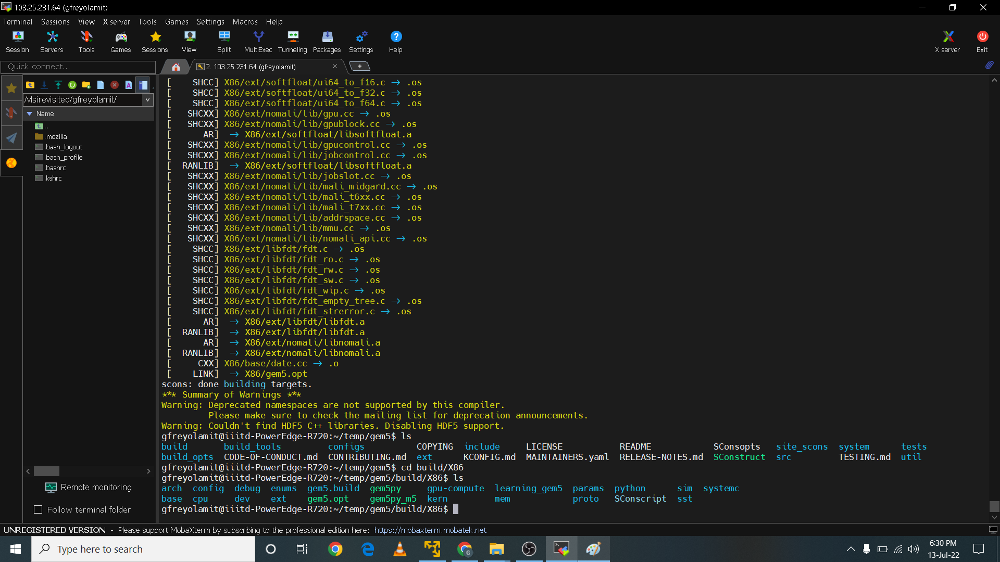
Dependencies

* git : gem5 uses git for version control.
* gcc: gcc is used to compiled gem5. Version >=7 must be used. We support up to gcc Version 11.
* Clang: Clang can also be used. At present, we support Clang 6 to Clang 11 (inclusive).
* SCons : gem5 uses SCons as its build environment. SCons 3.0 or greater must be used.
* Python 3.6+ : gem5 relies on Python development libraries. gem5 can be compiled and run in environments using Python 3.6+.
* protobuf 2.1+ (Optional): The protobuf library is used for trace generation and playback.
* Boost (Optional): The Boost library is a set of general purpose C++ libraries. It is a necessary dependency if you wish to use the SystemC implementation.

To install gem5 we need to install the dependencies. Setup on Ubuntu 18.04 (gem5 >= v21.0) If compiling gem5 on Ubuntu 18.04, or related Linux distributions, you may install all these dependencies using APT: ```sudo apt install build-essential git m4 scons zlib1g zlib1g-dev libprotobuf-dev protobuf-compiler libprotoc-dev libgoogle perftools-dev python3-dev python libboost-all-dev pkg-config```. After installing we can now proceed to cloning gem5 by using command ```git clone https://gem5.googlesource.com/public/gem5```. I then move to gem5 folder ```cd gem5```.
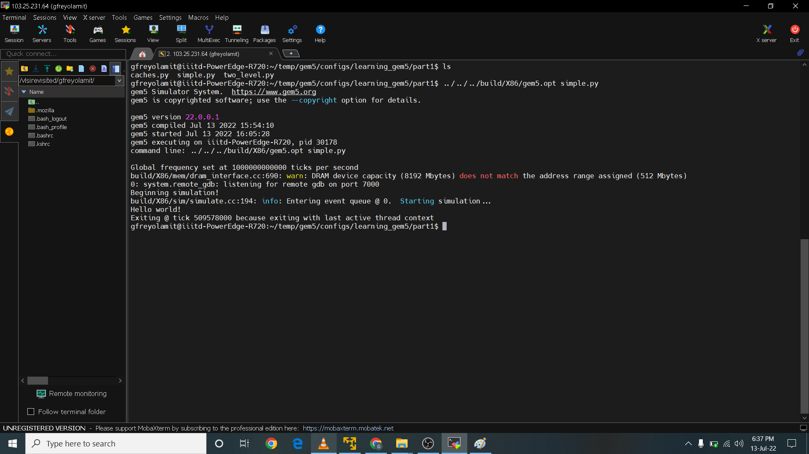
In this stage we then build X86 using gem5 with the command ```python3.6 $(which scons) build/X86/gem5.opt PYTHON_CONFIG=/usr/bin/python3.6-config -j8```. Then run the configuration file simple.py code after moving to its directory in temp/gem5/configs/learning/part1 with the command ```../../../build/X86/gem5.opt simple.py```. As we can see the simulation is successful as shown.

### Day2

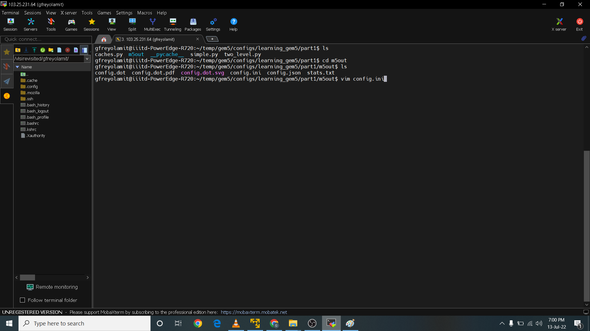
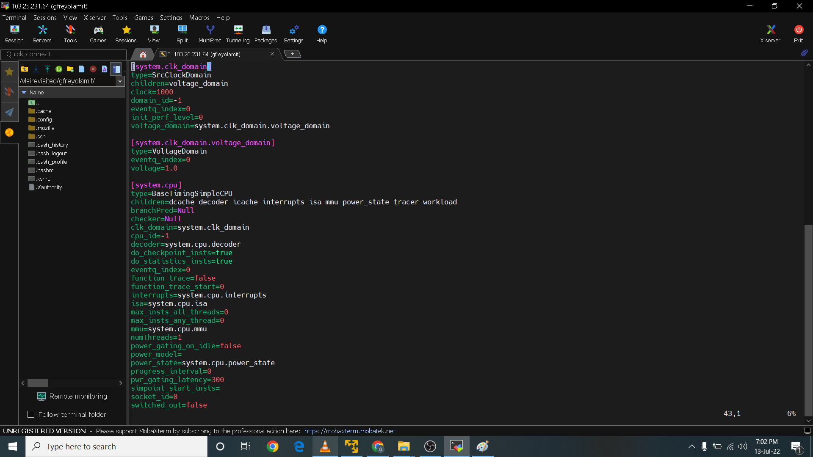
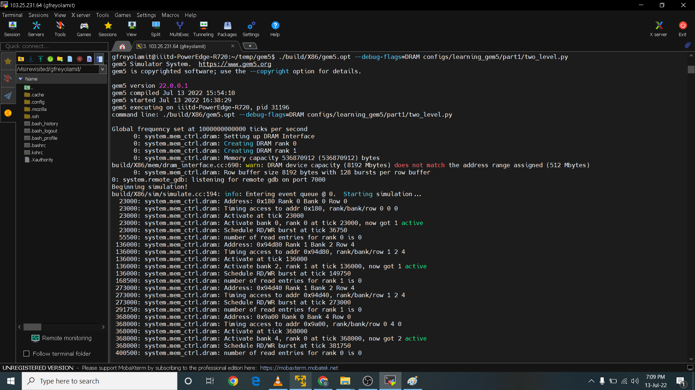

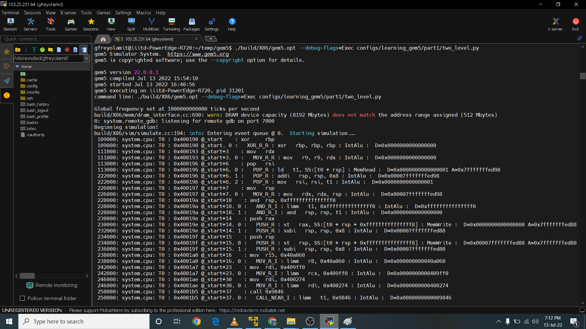
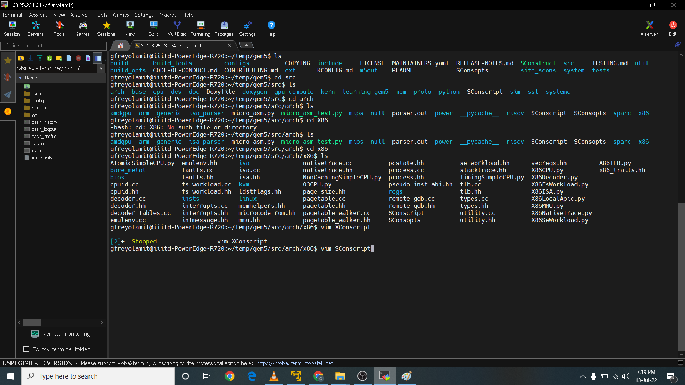
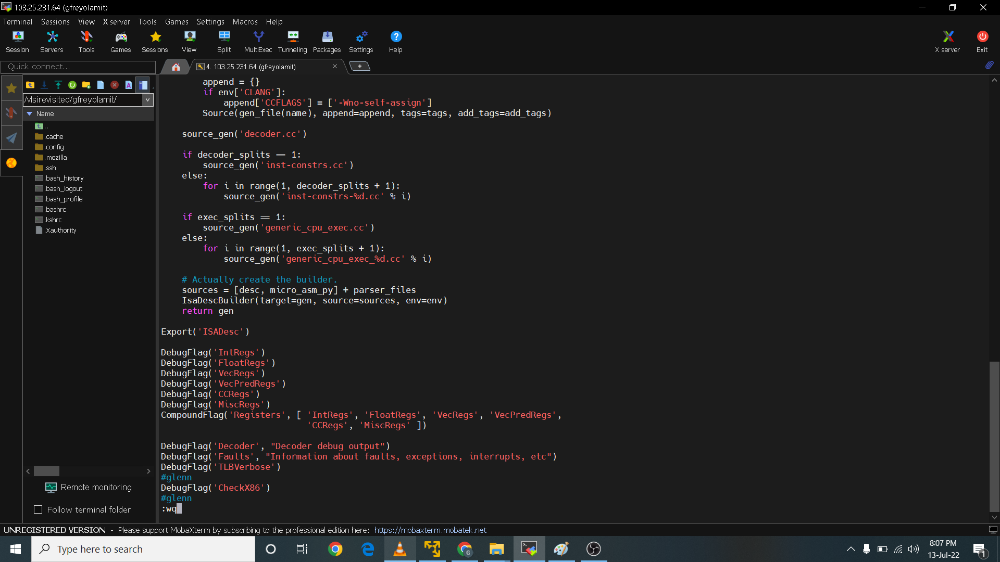
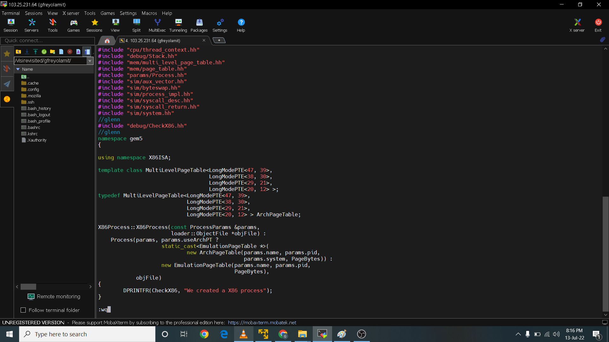
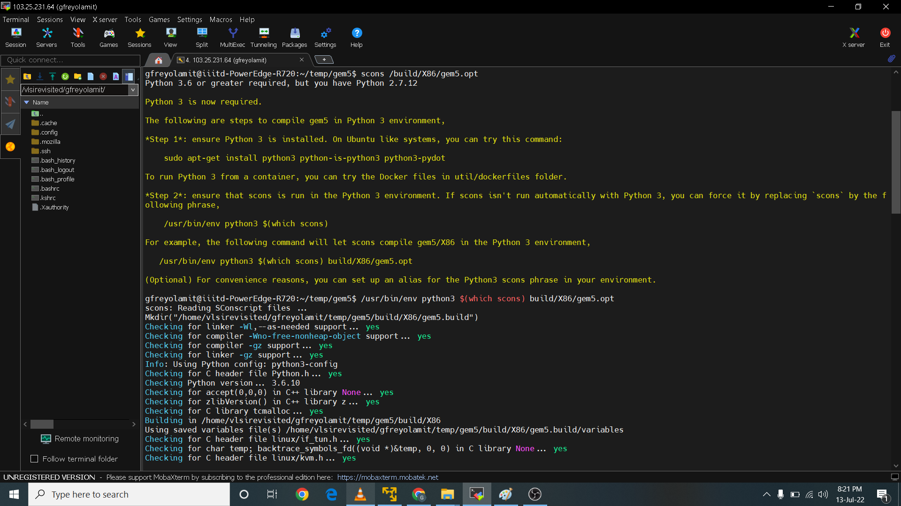
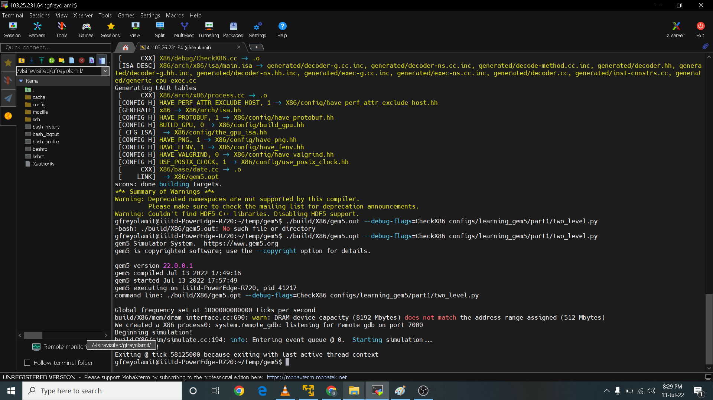

### Day4
In temp/gem5/configs/tutorial/part2 directory I created the configuration file in python named day4.py. The code is as shown. The code is an example of simplest configuration to run gem5 in simulation. The code from line 1 to 3 creates m5 and m5 object and then starts with root. Inside function Root() the full_system parameter is equal to false meaning it will do a syscall configuration mode. In the 4th line it is telling gem5 to start creatiing a new simulation object inside the root. NewObject is the name of the simulation object that we just created. Line 5 means we are instantiating the m5. Line 7 to 10 is straightforward.

```
import m5
from m5.objects import *
root = Root(full_system = False)
root.new = NewObject()
m5.instantiate()

print("Beginning simulation!")
exit_event = m5.simulate()
print('Exiting @ tick {} because {}'
      .format(m5.curTick(), exit_event.getCause()))
```
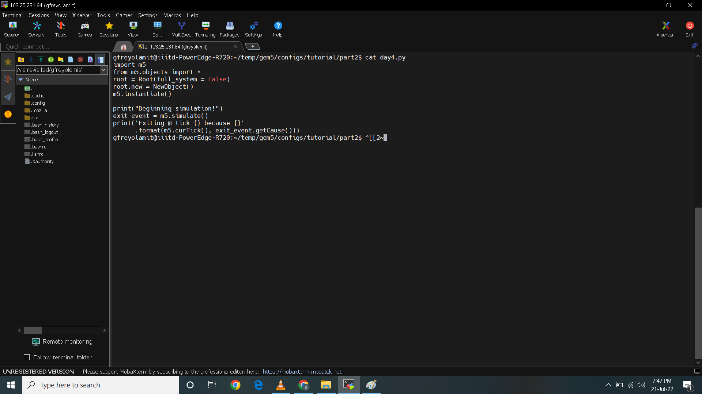
The new_object.hh is a header file. Every header file in gem5 has line 1,2 and 18. Line 4 means include those parameters which the gem5 will build into this header file. Line 5 is saying this is the header file of the simulation object. Line 7 to 16 means NewObject class is encapsulated with namespace gem5. Line 10 means your class NewObject specified in your .py file is inheriting to SimObject. This also means NewObject is a part of SimObject. Line 13 is just declaring a constructor. NewObjectParams is an object in which we can use to access gem5 parameters.
```
#ifndef __LEARNING_GEM5_NEW_OBJECT_HH__
#define __LEARNING_GEM5_NEW_OBJECT_HH__

#include "params/NewObject.hh"
#include "sim/sim_object.hh"

namespace gem5
{

class NewObject : public SimObject
{
  public:
    NewObject(const NewObjectParams &p);
};

} // namespace gem5

#endif // __LEARNING_GEM5_NEW_OBJECT_HH__
```
The new_object.cc is your working file. The first line is the location and the name of its header file. line 3 is basic cpp library. Line 6 to 16 is a namespace gem5. Line 9 is a constructor in it is a param object that we will be using to access parameters in gem5. Line 10 means SimObject also access using params object. Line 12 is straight forward. Line 13 means in this directory I will access my debug flag which is CheckX86.
```
#include "learning_gem5/Day4/new_object.hh"

#include <iostream>
#include "base/trace.hh"
#include "debug/CheckX86.hh"
namespace gem5
{

NewObject::NewObject(const NewObjectParams &params) :
    SimObject(params)
{
    std::cout << "Printing from the New Object we created\n!" << std::endl;
    DPRINTF(CheckX86, "Check X86 from new Object\n");
}

} // namespace gem5
```
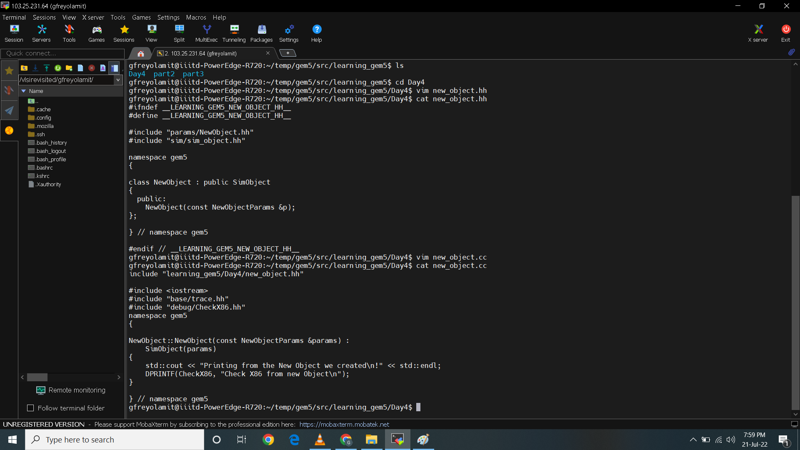 
NewObject.py file is a wrapper. In line 2-3 its importing necesssary objects and simulation object from gem5. Because gem5 is based on simulation object. In the fifth line you are creating a class name NewObject and your telling gem5 that it is a type of simulation object. In line 6 the type is normally the name of the class in this case NewObject. Line 7 will tell gem5 the location of the header file of the c plus plus code. In line 8 it is telling gem5 that in the cpp code in the gem5 namespace you are creating a simulation object name NewObject.
```
from m5.params import *
from m5.SimObject import SimObject

class NewObject(SimObject):
    type = 'NewObject'
    cxx_header = "learning_gem5/Day4/new_object.hh"
    cxx_class = "gem5::NewObject"
```
SConscript file is for scon environment which is the building environment of gem5. Line 1 means you want to import everything. Line 3 is telling gem5 that the simulation object is NewObject.py. In line 4 it is telling gem5 that the source code is new_object.cc.
```
Import('*')

SimObject('NewObject.py', sim_objects=['NewObject'])
Source('new_object.cc')
```
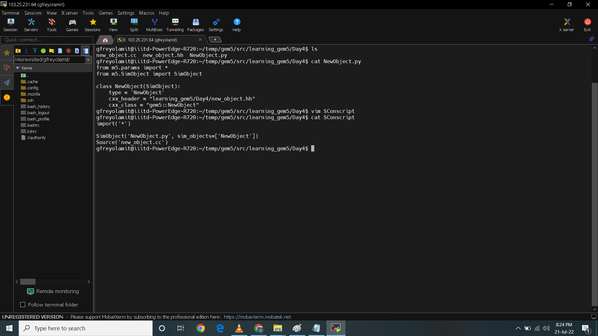
After adding the source file and config file in their respective location we need to build gem5 using the command bellow.
``` 
python3.6 $(which scons) build/X86/gem5.opt PYTHON_CONFIG=/usr/bin/python3.6-config -j8
```
After building the gem5, we can run X86 and run the configs and source file on top of it using the command
```
./build/X86/gem5.opt configs/tutorial/part2/day4.py
```
As shown the NewObject is created and simulation begins. The number of ticks is also shown.
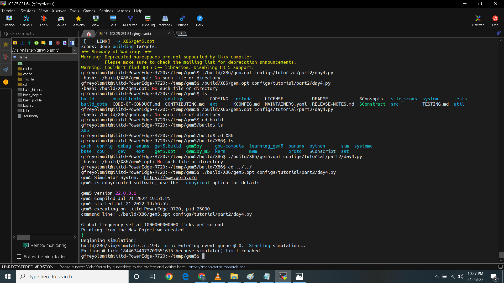

### Assignment 
```
Assignment

1. Create a SimObject that performs Inverse of a matrix. You can specify the matrix
elements without taking any user input.
2. Add two DEBUG flags whose functionalities are given below. Each DEBUG flag should
also have a proper description/annotation that is displayed on running the simulation.
a) DEBUG flag “MATRIX” will display the size and elements of the matrices.
b) DEBUG flag “RESULT” will display the resultant matrix.
3. Now that you have implemented your SimObject and added the required flags, create
the configuration script to use your new SimObject. You do not have to add a CPU or
caches to the system for this assignment.
4. You should also create a ReadMe file that explains the codes/ scripts submitted.
Submit your codes in a zip folder, clearly mentioning the names of the directory where
those files are located and the run directory.
```
For the assignment I just edited the c plus plus source code as shown below. The file directory can be found in gem5/src/learning_gem5/Day4. I deleted the line for CheckX86 and added header files for MATRIX and RESULT. I also edit the print line command to 'Sim Object that performs inverse of a matrix is created.'. I then added gem5 print function which is DPRINTF to print the matrix and the inverse matrix whenever we call for debug options. for MATRIX and RESULT respectively. Below is the updated source code.
```
#include "learning_gem5/Day4/new_object.hh"

#include <iostream>
#include "base/trace.hh"
#include "debug/MATRIX.hh"
#include "debug/RESULT.hh"
namespace gem5
{

NewObject::NewObject(const NewObjectParams &params) :
    SimObject(params)
{
    std::cout << "SimObject that performs Inverse of a matrix created\n!" << std::endl;
    DPRINTF(MATRIX, "MATRIX is :\n  1,  2,  3\n  0,  1,  4\n  5,  6,  0\n");
    DPRINTF(RESULT, "RESULT is :\n-24, 18,  5\n 20,-15, -4\n -5,  4,  1\n");
}

} // namespace gem5
```
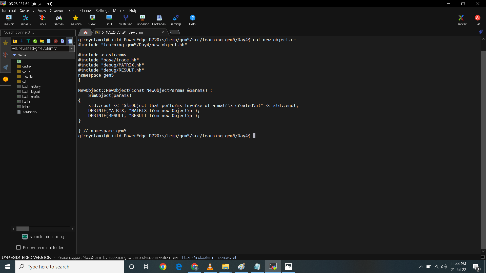
In the SConscript located temp/gem5/arch/ I edited SConscript by adding ```Debugflag('MATRIX') and Debugflag('RESULT')```. The additional commands is also shown in below printscreen.
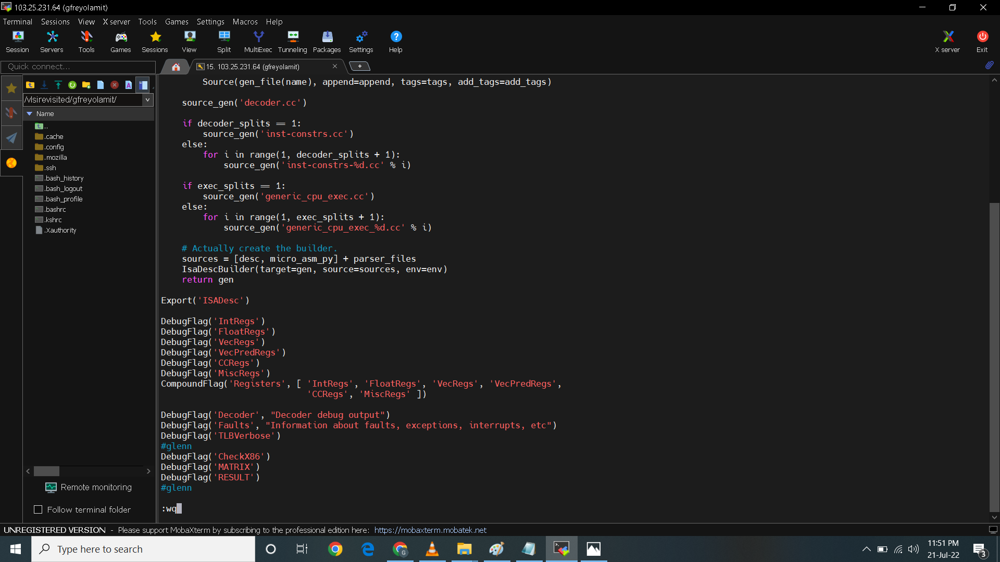
I then move to process.cc in temp/gem5/arch/X86 to edit the process.cc. Here I added the header ```include "debug/MATRIX.hh" and include "debug/RESULT.hh"``` as shown. I then added line for ```DPRINTFR(MATRIX, "We created a MATRIX process") and DPRINTFR(RESULT, "We created a RESULT process")``` as shown also. 
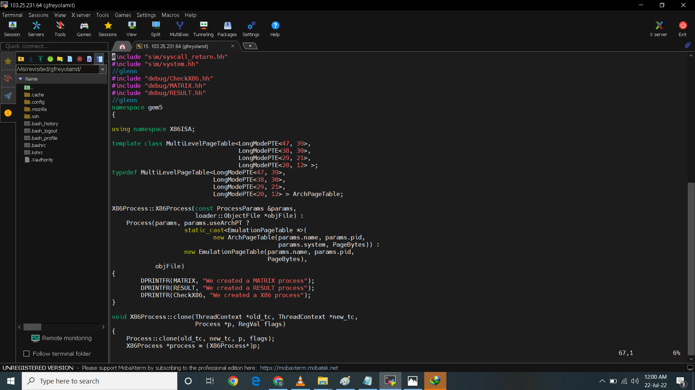
Below is the updated printscreen of source code. 
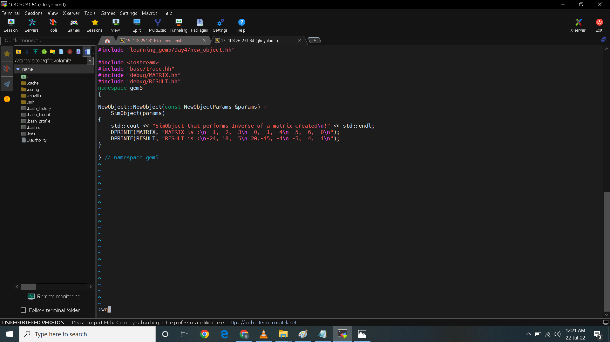
I then move to temp/gem5/src/learning_gem5/Day4. I then run ```scons build/X86/gem5.opt``` then run ```python3.6 $(which scons) build/X86/gem5.opt PYTHON_CONFIG=/usr/bin/python3.6-config -j8```.
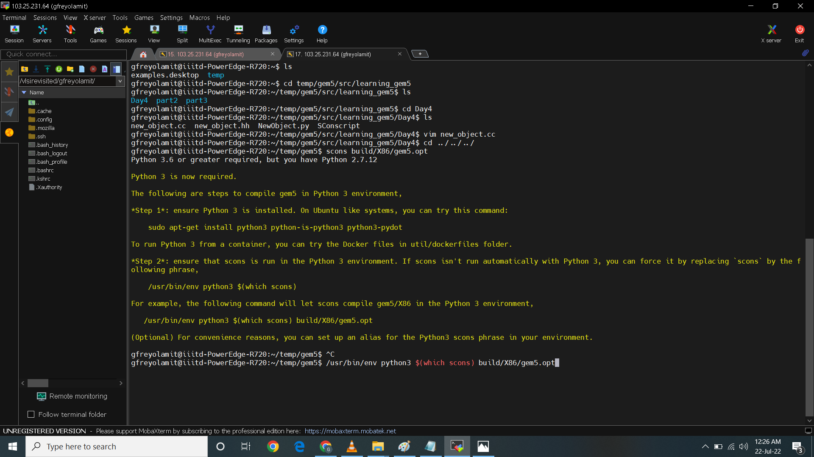
After rebuilding I then run the day4.py and got a success result as shown.
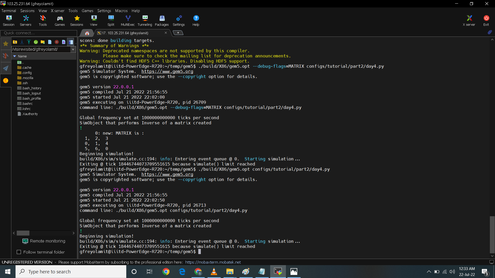
In below printscreen I run the command with debug option ```./build/X86/gem5.opt --debug-flags=MATRIX configs/tutorial/part2/day4.py```. The command display the element of the matrix as part of the assignment.
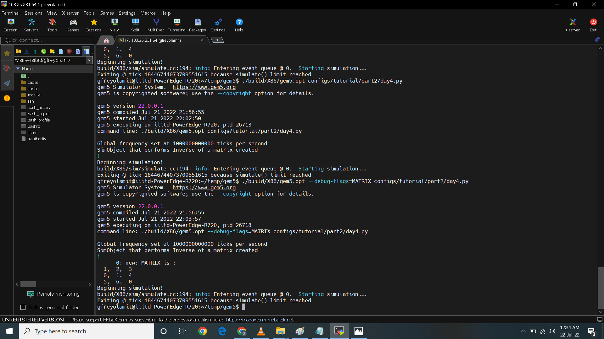
In below printscreen I run the command with debug option ```./build/X86/gem5.opt --debug-flags=RESULT configs/tutorial/part2/day4.py```. The command display the resulting inverse matrix as part of the assignment.


