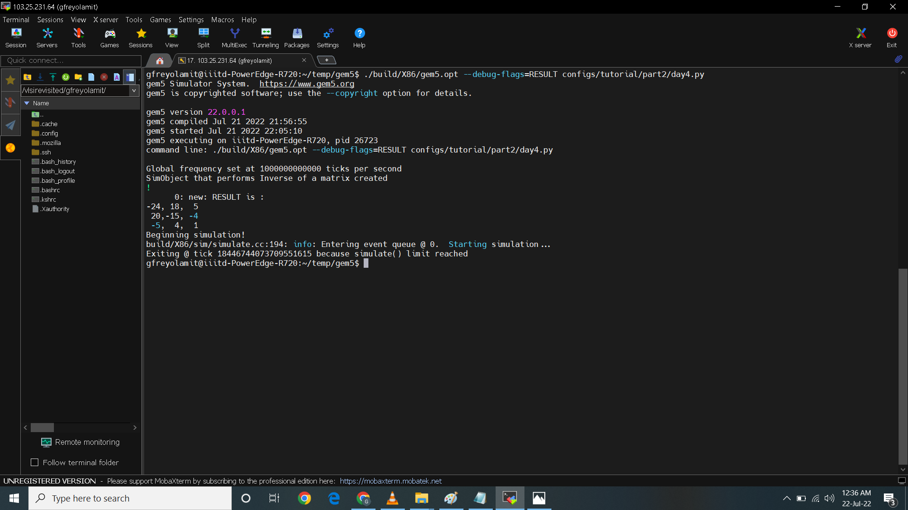

# comp_archi_SoC
Computer Architechture SoC
### Day1

### Day2

### Day4
In temp/gem5/configs/tutorial/part2 directory I created the configuration file in python named day4.py. The code is as shown. The code is an example of simplest configuration to run gem5 in simulation. The code from line 1 to 3 creates m5 and m5 object and then starts with root. Inside function Root() the full_system parameter is equal to false meaning it will do a syscall configuration mode. In the 4th line it is telling gem5 to start creatiing a new simulation object inside the root. NewObject is the name of the simulation object that we just created. Line 5 means we are instantiating the m5. Line 7 to 10 is straightforward.

``
import m5
from m5.objects import *
root = Root(full_system = False)
root.new = NewObject()
m5.instantiate()

print("Beginning simulation!")
exit_event = m5.simulate()
print('Exiting @ tick {} because {}'
      .format(m5.curTick(), exit_event.getCause()))
``

 

### Assignment 

